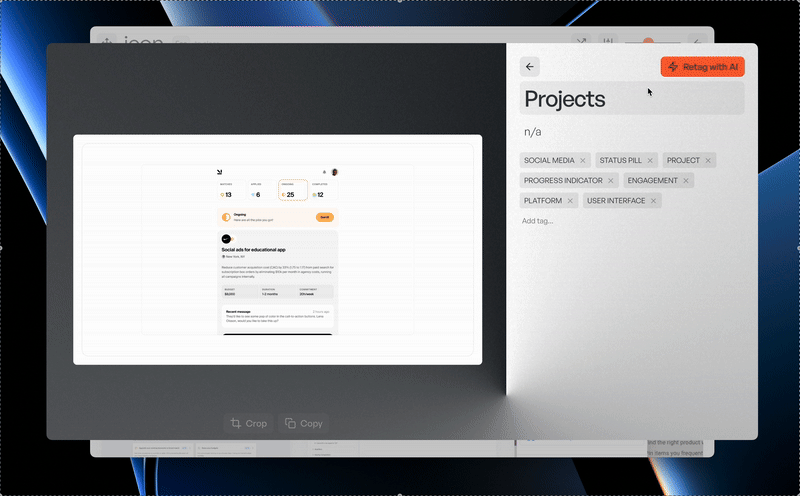

# Personal

A powerful desktop application built with Electron for managing and organizing references and photo collection folder with AI-powered features.

## Features

- 🖼️ **Modern Gallery Interface**: Masonry-style layout for elegant photo display
- 🤖 **AI-Powered Tagging**: Automatically generate tags and descriptions for your photos
- 📝 **OCR**: Automatically generate search metadata for your photos using OCR



## Installation

1. Clone the repository:
```bash
git clone [repository-url]
cd personal
```

2. Install dependencies:
```bash
npm install
```

3. Start the application:
```bash
npm start
```

## Building the Application

To build the application for your platform:

```bash
npm run pack
```

The built application will be available in the `dist` directory.

## System Requirements

- macOS (Windows support coming soon)
- Node.js 14.0 or higher
- Internet connection for AI features

## Technologies Used

- Electron
- Node.js
- Jimp (image processing)
- OpenAI/Anthropic API (AI features)
- Tesseract.js (OCR capabilities)
- Feather Icons
- Masonry Layout

## Configuration

The application stores photos in the user's home directory under the 'Personal' folder. AI features require an API key which can be configured in the settings.

## Keyboard Shortcuts

- `Ctrl/Cmd + =`: Zoom in
- `Ctrl/Cmd + -`: Zoom out
- `Ctrl/Cmd + 0`: Reset zoom
- `Esc`: Close modal/window

## Contributing

Contributions are welcome! Please feel free to submit a Pull Request.

## License

Creative Commons NonCommercial (CC BY-NC)
