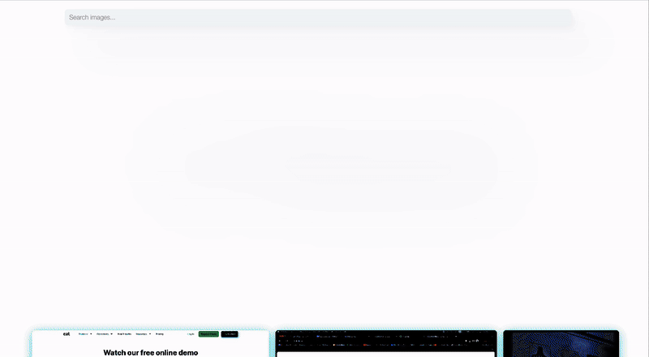

# じ Personal



**じ Personal** is your personal, local photo management solution—no cloud required. Take complete ownership of your files and keep your screenshots and images right where they belong: on your own device.

## Overview

**じ Personal** is a Node.js server that:
- Scans your local screenshots folder for image files.
- Uses OCR to extract text.
- Sends images to the OpenAI API to generate searchable tags based on a predefined prompt.
- Serves your images and metadata through a set of API endpoints.

## Folder Structure

Place the **じ Personal** folder inside the folder that contains your screenshots. The expected structure is:
 ```
/screenshots
├── [your image files…]
└── じ Personal
    ├── public/
    ├── server.js
    ├── images.json
    ├── package.json
    ├── .env
    └── README.md
```

**Note:** The server code expects the screenshots folder to be one level above it.

## Prerequisites

- [Node.js](https://nodejs.org/) (v14 or later recommended)
- NPM (or Yarn)
- An OpenAI API key

## Installation

1. **Clone or copy** this repository into your screenshots folder.
2. Open a terminal in the `じ Personal` folder.
3. Install the required Node.js dependencies by running:

 ```bash
   npm install
   ```
## Installation

   Create a .env file in the じ Personal folder with your OpenAI API key:
 ```bash
OPENAI_API_KEY=your-api-key-here
   ```

   This key is required for generating tags via the OpenAI API.


## Running the Server

To start the server, run the following command from within the server folder:

 ```bash
node server.js
   ```

   The server will run on port 3000. You can access it by navigating to http://localhost:3000 in your web browser.